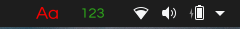
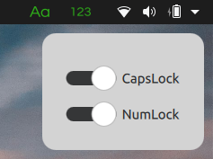
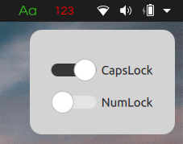

<h1> 
    c-n-lockindicator 
</h1>

## A simple capslock and numlock indicator developed using Qt and QML

> <h2> You can see the change on the status bar when you press Capslock or numlock 





> <h2>Second press  of capslock : 



# Downloads and Installation

* For now only compatabile with Debian based Linux distributions

* Go to [release](https://github.com/mehmetalicayhan/c-n-lockindicator/releases/tag/v1.0.0) page and download .deb file

* Open a terminal and enter following command
  
```
  sudo dpkg -i c-n-lockindicator1.0.0.deb  
```

<br>

# Building from source code without QtCreator

* Download or clone source code
  
``` 
  git clone https://github.com/mehmetalicayhan/c-n-lockindicator.git
```

* Create build directory

```
  mkdir build
```

* Go to build directory
```
  cd build
```  
* Enter following commands

```
  qmake ../ 
``` 

```
  make
```

